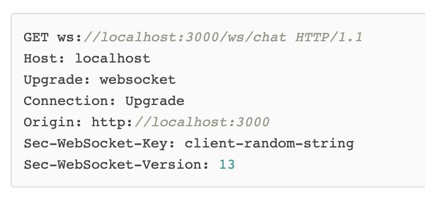
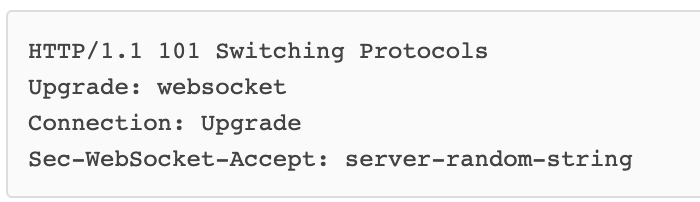

**无财作为, 少有斗智, 既饶争时**

7.1 WebSocket 与 socket
=================

WebSocket 是HTML5下的一种协议。与HTTP协议一样，都是属于应用层的协议；它是一种全双工协议，是建立在TCP协议之上的
建立连接时通过HTTP，但是再之后的通信中则不再需要
它实现客户端与服务器之间的双向通信，能更好的节省服务器资源和带宽并达到实时通讯的目的。
它和HTTP一样，通过已建立的TCP连接来传输数据。

## 7.1.1 特点
相对与ajax轮询，真正意义上实现了双方通信，及客户端可想服务器主动发送信息，服务器也可以主动向客户端发送信息
1.全双工方式，建立连接后，可相互主动请求
2.HTTP长连接中，每次数据交换除了真正的数据之外，客户端与服务器还交换了大量HTTP header，信息交换效率低

## 7.1.2 请求&响应

- 如上图所示，相对于传统的HTTP协议的请求头，WebSocket在请求行中，地址信息为`ws`开头；
- 在请求头部中，多了以下两个信息，对服务器标记，这个请求不同与HTTP协议
    
    
    Upgrade: websocket
    Connection: Upgrade

- Sec-WebSocket-Key是用于标识这个连接，并非用于加密数据；
- Sec-WebSocket-Version指定了WebSocket的协议版本

- 该响应代码101表示本次连接的HTTP协议即将被更改；
- 更改后的协议就是Upgrade: websocket指定的WebSocket协议

为什么WebSocket连接可以实现全双工通信而HTTP连接不行呢？
实际上HTTP协议是建立在TCP协议之上的，TCP协议本身就实现了全双工通信，
但是HTTP协议的请求－应答机制限制了全双工通信。
WebSocket连接建立以后，其实只是简单规定了一下：接下来，咱们通信就不使用HTTP协议了，直接互相发数据吧。

## 7.1.3 WebSocket与socket区别

socket并不是一个协议，它只是为了方便TCP或UDP而抽象出来的一层，是位于应用层与传输层之间的一组接口

Socket是应用层与TCP/IP协议族通信的中间软件抽象层，它是一组接口。

在设计模式中，Socket其实就是一个门面模式，它把复杂的TCP/IP协议族隐藏在Socket接口后面，对用户来说，一组简单的接口就是全部，让Socket去组织数据，以符合指定的协议。

当两台主机通信时，必须通过Socket连接，Socket则利用TCP/IP协议建立TCP连接。TCP连接则更依靠于底层的IP协议，IP协议的连接则依赖于链路层等更低层次。

**Socket是传输控制层协议，WebSocket是应用层协议。**

## 7.1.4 HTML5与WebSocket的关系

WebSocket API 是 HTML5 标准的一部分， 但这并不代表 WebSocket 一定要用在 HTML 中，或者只能在基于浏览器的应用程序中使用。
实际上，许多语言、框架和服务器都提供了 WebSocket 支持

