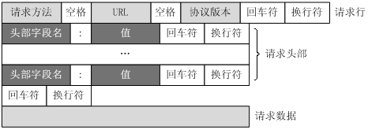
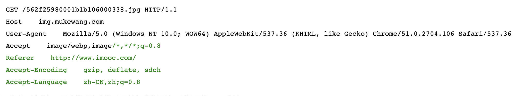
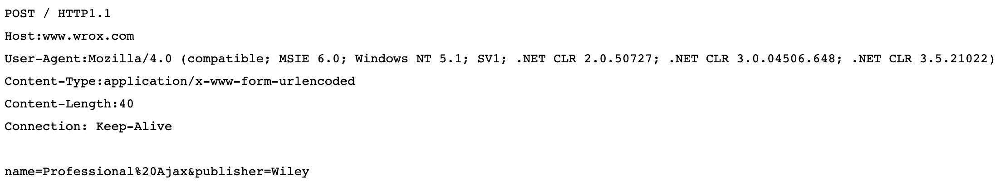

**无财作为, 少有斗智, 既饶争时**

7.2 HTTP协议
==========

## 7.2.1 概述
1. 用于万维网传输超文本到本地服务器的传送协议
2. 是一个基于TCP/IP协议来传输数据
3. 是一个基于应用层的面向对象的协议
4. 工作于客户端与服务器，通过URL向服务器发送请求及消息，接收到请求后再返回

## 7.2.2 特点
1. 简单快速：客户端向服务器发送请求时，只请求方法和路径。由于HTTP协议简单，使得HTTP服务器规模较小，进而传递速度快；
2. 灵活：HTTP可传输任意类型的数据对象，用content-type标记；
3. 无连接：每次只传输一次，完成及断开连接，节省传输时间；
4. 无状态：因为无连接，则无法记住上一次传递的信息，则每次需要重传；

## 7.2.3 URL
HTTP是通过URL来传递数据和建立连接
    
    `http://www.aspxfans.com:8080/news/index.asp?boardID=5&ID=24618&page=1#name`

以上链接包含如下部分

1. 协议: http
2. 域名: www.aspxfans.com
3. 端口: 8080
4. 虚拟目录: 第一个 '/' 到最后一个 '/' 之间， 即'new'，非必须
5. 文件部分: index.asp，非必须
6. 锚部分: name，非必须
7. 参数: 从'?'开始，到'#'号之间， boardID=5&ID=24618&page=1，用' &'分隔

## 7.2.4 REQUEST
客户端发送一个HTPP请求，包含以下格式: **请求行、请求头、空行、请求数据**

**GET请求**

包含以下部分

1. 请求行: 包含 请求方式(GET)、请求资源、协议版本，以空格分隔
2. 请求头部: Host请求目的地，以及一些配置信息(User-Agent, Content-Type, Accept等)
3. 空行: 请求头部后面的空行是必须的，即时第四部分为空
4. 请求体: 可添加任意其他数据，该例子中为空

**POST请求**

1. 请求行: 同GET
2. 请求头部: 同GET，第二行至第六行
3. 空行: 第七行
4. 请求体: 请求数据，第八行

## 7.2.5 RESPONSE
服务器处理客户端发送的请求，返回一个HTTP响应消息；

HTTP响应由：**状态行，消息报头，空行，响应正文** 四部分组成，如下图所示

1. 状态行: 第一行，由HTTP协议版本号(HTTP/1.1)，响应状态码(200)，状态消息(OK)，由空格分隔；
2. 消息报头: 第二行至第四行，用来说明客户端要使用的一些附加信息
3. 空行: 第五行，消息报头后的空行是必须的
4. 响应正文: 第六行至末尾，HTML部分

## 7.2.6 GET与POST区别
1. 提交:
    
    GET请求数据在请求行中，POST请求数据在请求体中
2. 数据传输大小:

    GET请求在数据大小为URL长度，受不同浏览器限制;
    
    POST请求，因为数据在请求体中，所以不受限制，但是请求体大小受服务器限制
3. 安全性:

    GET请求因为数据在URL中，而POST请求在请求体中，所以GET不安全，POST相对更安全
4. 取值:

    GET请求需使用Request.QueryString来取值，而POST请求Request.Form来获取

## 7.2.7 HTTP工作原理
1. 客户端连接到服务器
    
    客户端与Web服务器的端口建立一个TCP套接字连接
2. 发送HTTP请求
    
    通过TCP套接字，客户端向Web服务器发送一个文本的请求报文，一个请求报文由请求行、请求头部、空行和请求数据4部分组成
3. 服务器接收请求并返回HTTP相应
    
    Web服务器解析请求，定位请求资源。服务器将资源复本写到TCP套接字，由客户端读取。一个响应由状态行、响应头部、空行和响应数据4部分组成。
4. 释放连接

    若connection 模式为close，则服务器主动关闭TCP连接，客户端被动关闭连接，释放TCP连接;若connection 模式为keepalive，则该连接会保持一段时间，在该时间内可以继续接收请求;
5. 客户端解析HTML内容

    客户端浏览器首先解析状态行，查看表明请求是否成功的状态代码。然后解析每一个响应头，响应头告知以下为若干字节的HTML文档和文档的字符集。客户端浏览器读取响应数据HTML，根据HTML的语法对其进行格式化，并在浏览器窗口中显示。

## 7.2.8 cookie与session

**cookie**

cookie是访问某些网站后，存储在本地服务器的一些信息，下次访问时减少一些步骤；
服务器在本地机器上存储的小段文本并随每一个请求发送至同一个服务器，是一种在客户端保持状态的方案。

cookie 主要包含名字，值，过期时间，路径及域；
    
    以key,value的形式存储信息；
    过期时间可以自己设置，如果不设置，则浏览器关闭则消失，是存储在内存中的；否则则是存储在本地，当过期后，自动删除
    同一个
    支持跨域，比方说a.com的Cookie在a.com下都能用
    
**session**

session是存储在服务器上的，用来存储用户数据的HashTable

    当浏览器 第一次发送请求时，服务器自动生成了一个HashTable和一个Session ID用来唯一标识这个HashTable，并将其通过响应发送到浏览器。当浏览器第二次发送请求，会将前一次服务器响应中的Session ID放在请求中一并发送到服务器上，服务器从请求中提取出Session ID，并和保存的所有Session ID进行对比，找到这个用户对应的HashTable。
    www.a.com的Session在api.a.com不能使用
        
我们可以将session id 存储在cookie中，每次访问时，将这个session id 传过去     
