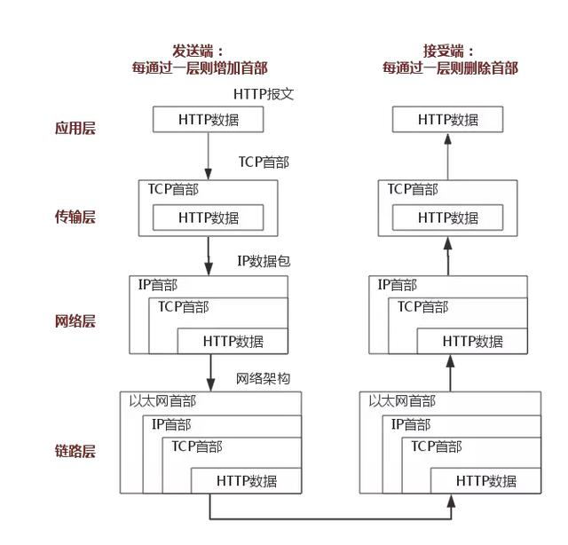

**无财作为, 少有斗智, 既饶争时**

TCP/IP 协议
=============

TCP/IP是一个协议族，包含了HTTP, TCP, UDP, IP, ARP, RARP等多个协议组成

## 协议层分类
协议层从底层到顶层模型图

下图左边是OSI模型的分层，分层较复杂；右边是TCP/IP的分层

1. 应用层：应用层决定了向用户提供应用服务时通信的活动， 比如FTP与DNS服务；HTTP协议属于该层
2. 传输层：传输层提供两台计算机之间的数据传输，主要包含TCP与UDP协议
3. 网络层：处理在网络上流动的数据包，数据包为传输的最小单位；该层决定了数据的流向，具体传到哪一台计算机
4. 链路层：硬件部分；包括操作系统，网卡，驱动，光纤等

以HTTP协议为例，请求在传递过程中，从上往下，每一层都会对数据头部进行封装，再从下往上解封，实际就是一个入栈与出栈的过程，如下图所示

## 应用层

HTTP协议见 [HTTP协议](./G0002_http.md)

DNS(域名系统)，用于映射域名与IP

## 传输层
该层主要包含TCP协议与UDP协议

TCP协议是面向连接的，将数据切分为一个个数据包，并标号顺序，进行数据传输，以确保数据能够正常有序到达；
TCP主要通过端口号来确认应用程序
#### 三次握手：

在数据传输开始之前，保证双方建立连接，同步双方序列号

- 第一次握手，建立连接，发送报文，等待服务器响应
- 第二次握手，服务器收到报文，确认信息，返回客户端
- 第三次握手，客户端收到服务器响应，完成握手

意义：当一个数据包请求时间过长，比第二次发送数据包还要晚，如果服务器处理这条晚到的请求，并且客户端还进行了响应，就会造成重复；

#### 四次挥手

当数据传输完成，则需要断开连接，即需要四次挥手

- 第一次，客户端发送已没有报文再发送的报文
- 第二次，服务器收到报文，响应同意断开
- 第三次，服务器再次发送报文，请求断开连接
- 第四次，客户端收到第三次报文段后，再次发送ACK报文，服务器收到该报文后，则断开连接，如果客户端等待2MSL后，无响应，则客户端也断开连接

**注---MSL: 报文段的最大生存时间**

意义：避免未完成的数据报文正常 

#### 拥塞控制，流量控制
流量控制(简略)：如果发送方把数据发送得过快，接收方可能会来不及接收，这就会造成数据的丢失。
所谓流量控制就是让发送方的发送速率不要太快，要让接收方来得及接收。这个传输的数值是由接收方设置的；
**待续**

#### TCP与UDP区别及场景
区别

应用场景

## 网络层
网络层的主要工作，定义网络地址，区分网段，子网内MAC地址寻址，对于不同子网的数据包进行转发；
IP协议是不安全，他并不保证数据能有效的传输，这是应用层所需要关心的事情

#### IP协议
- 大致分为3个模块，IP地址，路由(节点的转发)，IP分包和组包
- IP协议的作用是把数据传输给接收方，主要通过IP地址及MAC地址
- MAC地址用来唯一标志主机，IP地址可变，但是MAC地址一般不会变

用于区分目的主机与源主机是否在同一网段，以192.168.24.1为例，前24位为网络地址，后8位是主机地址，
若网络地址相同，则在同一子网内；引入子网掩码，与IP地址做与运算，得到网络地址

#### ARP协议
地址解析协议，主要作用是通过IP地址获取MAC地址

ARP协议先发起一个数据包，头部包含了目的主机的IP地址，再到链路层，封装以太网数据包，最终由以太网广播给子网内的所有主机，
主机在收到这个包后，获取其中的目的主机IP，与自己对比，若相同，则返回自己的MAC地址，ARP在接收到这个MAC地址后确定目的主机；
同时还会缓存一定时间该MAC信息，节省下次时间；可通过arp -a查询缓存的MAC信息

#### 路由协议
通过IP协议，若得知目的主机在同一子网，则直接通过ARP协议，找到目的主机，并发送消息

但是大多数时候，目的主机与源主机都不在同一局域网内；这时候就需要引入路由协议；
如果不在同一子网，以太网会将数据包发送给本子网的网关进行路由，经过多次的转发，最终找到目的主机，再进行数据的传输；
这就要求主机必须包含路由的能力

## 总结
当你输入一个网址并按下回车键的时候：
- 首先，应用层协议对该请求包做了格式定义；
- 紧接着传输层协议加上了双方的端口号，确认了双方通信的应用程序，数据包传输；
- 然后网络协议加上了双方的IP地址，确认了双方的网络位置；
- 最后链路层协议加上了双方的MAC地址，确认了双方的物理位置，同时将数据进行分组，形成数据帧，采用广播方式，通过传输介质发送给对方主机。
- 而对于不同网段，该数据包首先会转发给网关路由器，经过多次转发后，最终被发送到目标主机。目标机接收到数据包后，采用对应的协议，对帧数据进行组装，
然后再通过一层一层的协议进行解析，最终被应用层的协议解析并交给服务器处理。

