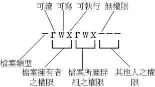

2.1 文件权限
============

## 2.1.1 用户信息

系统账号信息: `/etc/passwd`;

个人密码记录: `/etc/shadow`;

组名记录: `/etc/group`;

## 2.1.2 文件目录解析

- 第一部分：文件的类型与权限
- 第二部分：连接数
- 第三部分：文件或目录的拥有者
- 第四部分：文件或目录所属群组
- 第五部分：文件的容量大小，默认单位为bytes
- 第六部分：建档日期或最后修改日期
- 第七部分：文件名称

其中第一部分详细: 共十个字符

其中第一个字符代表这个文件是  `目录` `文件` `软链接` 等等

- 当为 `[d]` 则是目录，例如上表档名为『.gconf』的那一行； 
- 当为 `[-]` 则是文件，例如上表档名为『install.log』那一行； 
- 若是 `[l]` 则表示为连结档(link file)； 
- 若是 `[b]` 则表示为装置文件里面的可供储存的接口设备(可随机存取装置)； 
- 若是 `[c]` 则表示为装置文件里面的串行端口设备，例如键盘、鼠标(一次性读取装置)。

**接下来的9个字符，每3个为一组，对应 `u-g-o` 分别的权限，`r-read-` 写，`w-write-` 读，`e-execute-` 执行，没有则用 `-` 代替**

第二部分，表示有多少档名连结到此节点（i-node）

## 2.1.3 文件权限

1.若目录 u-g-o 中任意一个，只有权限中只有  r 而没有 x ，则对应人员或群组不能进入此目录
- u: 所有人
- g: 群组
- o: 其他人

2.改变文件的属性与权限

-chgrp：改变文件所属群组 change group
       
    chgrp [-R] dirname/filename ...
进行递归的持续变更，即原目录下所有文件和目录均改变所属群组；若群组不存在，会报错。

-chown：改变文件拥有者 change owner，也可以顺便修改群组

    chown [-R] 账号名称 文件或目录
    
    chown [-R] 账号名称:组名 文件或目录
- chmod：改变文件的权限，SUID，SGID，SBIT等等特性

    数字类型权限：r-4，w-2，x-1
    
    755：除拥有者外，其余均无写入操作
    
    644：为不可执行文件，除拥有者外，其余也无写入操作
    
    10、除u-g-o外，还有a，代表全部的身份；
    
    \+ 加入，-除去，= 设定
    
    `chmod ugo+rwx filename` 为该文件的相关用户添加所有权限
    
    `chmod 777 filename`  同上
    
    `chmod a+x filename`  为文件所有的相关用户添加可执行权限

3.权限对目录意义

r （read contents in directory ） 可进入此目录查看目录下的文件信息，即执行ls命令
w  (modify contents of directory) 表示你具有异动该目录结构列表的权限 
x  (access directory)  进入该目录的权限，即可执行  “cd  目录名 ”

4.根目录（/）所在的分割槽应该越小越好，且应用程序所安装的软件最好不要与根目录放在同一分割槽内，保证根目录越小越好。以此保证根目录所在的文件系统也不容易发生问题

## 2.1.4 几个重要目录
/bin 目录，放置执行文件的目录，放置的是在单人维护模式下还能够被操作的指令，root与一般用户均能执行的指令，cat、chmod、mkdir、bash等；

/sbin目录，放置了开机过程所需的，里面包含开机、修护、还原系统所需要的指令。只有root才能执行，其他用户只能用来 查询，比如：ifconfig、init、fsck等等；

/usr/bin目录，绝大部分用户指令都放在这里，与开机过程无关；

/usr/sbin目录，非系统正常运作所需要的指令。如服务器指令