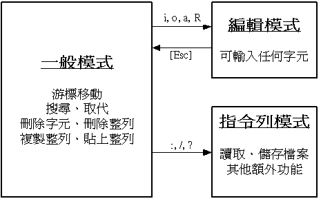

2.2 VI文字处理
=============

### VI模式 

vi进入文档，可分为三种模式，分别是一般模式、编辑模式、指令列命令模式

### 一些常用快捷键

1.一般模式下的快捷键

- crtl+b，屏幕向后移动一页
- crtl+f，屏幕向前移动一页
- H，M，L，光标分别移动到屏幕最上方、中央、最下方那一行
- G，移动到文件的最下方
- n<space>，按下数字，再按空格，会移动到这一行的第n个字符。
- nG移动到文件的第n行，
- n<enter>，会向下移动n行；
- /word，向光标之后寻找一个字符串名称为word的字符串；?word，是想光标之前寻找；
- :1,$s/word1/word2/g，从第一行到最后一行寻找word1字符串，并将该字符串取代为word2
- x,X，x向后删除一个字符，X向前删除一个字符
- dd，删除光标所在那一整行；ndd删除光标之后n行
- yy，复制到光标所在那一行
- p，粘贴复制的数据在光标的下一行；P为上一行
- u，复原前一个动作

2.编辑模式的快捷键

- o,O，插入新一行，o在当前行之后，O在当前行之前
- 批量操作文本中的一列，先按Ctrl+v，再按上下键进行选择，删除可按 d

### 记不住的

1.防火墙&端口：
- 路径 `/etc/sysconfig/iptables`
- 重启防火墙 `service iptables restart`

2.压缩与解压

+ -c:建立压缩档案
+ -x:解压
+ -t:查看内容
+ -r:向压缩归档文件末尾追加文件
+ -u:更新原压缩包中的文件
**这五个是独立的命令，只能有其中一个**

+ -z:有gzip属性
+ -j:有bz2属性的
+ -Z:有compress属性的
+ -v:显示所有过程
+ -O：将文件解开到标准输出

**参数-f是必须的，-f使用档案名字，只能是最后一个参数，后面接档案名**

### vim一些习惯设置

修改配置文件`/etc/vimrc`
1.设置tab默认4个空格，以及自动换行；

    set ts=4
    set expandtab
    set autoindent
    
2.显示行号

    set number
    
3.打开语法高亮

    syntax on
    
4.按下 `>>` (两个大于符号)增加一级缩进; 按下 `<<` (两个小于符号)减少一级缩进

    set expandtab
    
5.光标所在行高亮

    set cursorline
    
6.光标移到到圆括号、方括号、大括号时，自动高亮对应的另一个圆括号、方括号和大括号

    set showmatch
    
7.打开英语单词的拼写检查

    set spell spelllang=en_us

具体配置文件 [vimrc](../Linux/vimrc)
