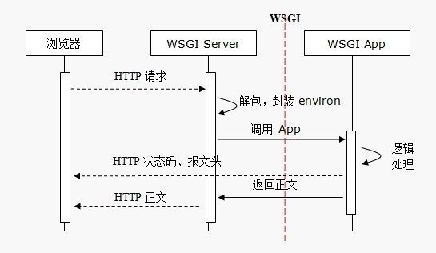

**无财作为, 少有斗智, 既饶争时**

1.9 flask
===========
flask是一个轻量级的框架,本身依赖较少,只需要WSGI工具--- Werkzeug,以及模板引擎--Jinja2, 其他的都通过第三方库来实现

## 1.9.1 flask的优点
- 轻巧, 只提供核心功能, 适合小型网站
- 简洁
- 扩展性强, 第三方库选择较多

## 1.9.2 Werkzeug
参考:

[flask上下文](https://www.cnblogs.com/lilz/p/10250588.html)
[flask-werkzeug](https://www.cnblogs.com/xiaoyuanqujing/articles/11643999.html#_label0)

Werkzeug 是一个WSGI的工具包，不是一个框架，它是一个socket服务
Flask 基于Werkzeug，只保留web开发的核心功能

1. 首先从environ转换request，获取request和session，
2. 把request放入一个栈`_request_ctx_stack`的`top`中。LocalStack对应一个线程
3. 在请求中，通过`request`去获取相应的对象

## 1.9.3 jinja2
TML文档中使用控制语句和表达语句替换HTML文档中的变量来控制HTML的显示格式

## 1.9.4 流程

